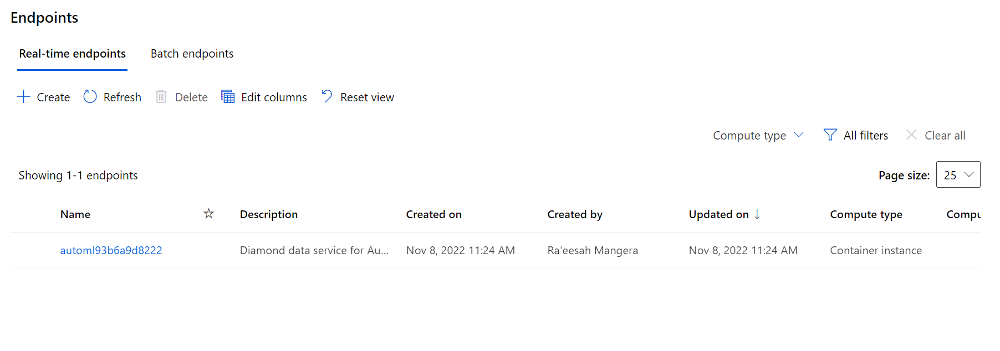

# Predicting diamond price 

In this project we use a dataset which contains the features of round polished diamonds such as the 4C's (cut, clarity, colour and carat) to predict the price of the diamond. First, AutoML is used to find an optimal regression model. This is compared to a Histogram Boosted Gradient Model whose hyperparameters have been optimised using Hyperdrive. The best model from both experiments is registered in the workspace. Both models are evaluated on test data and the best one is deployed as a webservice.

## Project Set Up and Installation
In order to run this project version 1.47 of the Azure ML SDK must be used. 

## Dataset

### Overview
The dataset that will be used in this experiment is from Kaggle. It is a tablular dataset that contains 10 features related to polished diamonds such as the cut, carat weight and colour. The aim of the data is to use these features to predict the price of the polished diamond. Most of the features are numeric but the cut, clarity and colour are categorical variables which are ordinal in nature. 

The dataset can be downloaded from:
www.kaggle.com/datasets/nancyalaswad90/diamond-prices

### Task
The features from the dataset are used to predict the price for round polished diamonds in dollars.

### Access
The dataset was uploaded and registered to the Azure Machine Learning Studio. We access the dataset using its key within the Jupyter notebook and the training script.

## Automated ML
The AutoML task is set to regression as we want to predict a numerical value (diamond price) from a set of features. We will use the compute cluster that already exists in the workspace to train the model. The experiment is set to time out after 30 minutes so that we don't consume an indefinite amount of resources. The primary metric that will be optimised is normalized_root_mean_squared_error as we want to minimise the average squared error. As the dataset is not very large, 5 cross-validations are used. Featurisation is enabled as no data cleaning was done after reading in the data and inputting it to the AutoML model. Early stopping is also enabled.

### Results
A total of 23 models were trained by the AutoML model. The best model was a Voting Ensemble. This makes sense as it combines the results from many models rather than a single model.  A Voting Ensemble predicts based on the weighted average of predicted regression targets. At a high level, the Voting ensemble algorithm initializes the ensemble with up to five models with the best individual scores, and verifies that these models are within 5% threshold of the best score to avoid a poor initial ensemble. Then for each ensemble iteration, a new model is added to the existing ensemble and the resulting score is calculated. If a new model improved the existing ensemble score, the ensemble is updated to include the new model.

Looking at the feature importance (using Explain Model) we see that the carat,y cut and clarity were the most important features. 

## Model improvement 
The model may be improved by using custom featurization instead of using the auto featurization before model training. By specifying custom featurization we can improve the model performance as we can include domain knowledge. In particular:
* Cleaning could be done to remove the "Column2" feature as this is just the index of the sample in the dataset and is not correlated to the diamond price. 
* Represent the categorical features such as cut, clarity and colour as integers as these features are ordinal. For example a diamond which is slightly included is worth less compared to a flawless diamond

The RunDetails widget shows the completed runs.

The screenshot below shows the best model trained with its parameters:

## Hyperparameter Tuning
*TODO*: What kind of model did you choose for this experiment and why? Give an overview of the types of parameters and their ranges used for the hyperparameter search

Gradient boosting is an ensemble of decision trees algorithms. It is a popular techniques for tabular regression predictive modeling problems given that it performs well across a wide range of datasets in practice. A major problem of gradient boosting is that it is slow to train the model. This is particularly a problem when using the model on large datasets with tens of thousands of examples as is the case for the diamond dataset. This training can be accelerated by binning the continuous variables so that the input variables can be reduced to fewer unique values. This is then referred to as histogram gradient bootsing and is the model employed for the diamond dataset hyperdrive experiment.

Prior to training the data was cleaned. The "Column2" feature was removed as it is just the number of the entry in the dataset and is not correlated with the diamond price. The categorical variables were converted to integer values representing the ordinal nature of the category. For example with know that a diamond with no inclusions is better and hence more valuable compared to a diamond that is slightly included.

In the experiment, two hyperparameters are tuned the learning rate and the maximum tree depth. The learning rate controls the impact of each tree on the final outcome. GBM works by starting with an initial estimate which is updated using the output of each tree. The learning parameter controls the magnitude of this change in the estimates. Lower values are generally preferred as they make the model robust to the specific characteristics of tree and thus allowing it to generalize well. Lower values would require higher number of trees to model all the relations and will be computationally expensive. In the experiment the learning rate is a uniform distribution from 0.001 and 0.05. 

The maximum tree depth is the maximum depth of a tree. It is used to control over-fitting as higher depth will allow model to learn relations very specific to a particular sample. In the experiment this is a choice of values between 8 and 30. We saw that higher values for this resulted in a smaller mean squared error but when evaluating the best model on a test set the model did not perform as well.

A Bandit Early stopping policy is specified to stop poorly performing jobs and improve computational efficiency. The benefit of BanditPolicy is that it allows us to define a minimum required improvement to continue with the parameter search. A random sampling method is used as it is not as computationally expensive as a grid search or Bayesian samplling and based on experience in previous projects yield similar results. The goal of the experiment is to minimise the mean squared error as this is a regression task so we want to minimise the error between the actual diamond price and the predicted diamond price.

### Results
The best model obtained achieves a mean squared error of less than 0.2. This model had a low learning rate of just 0.001 and a maximum depth of 20. When the model was tested on test data and accuracy of 64%. Comparing this to the average accuracy obtained by the AutoML model of 93% the hyperdrive model performance was not as good. It is possible that using such a high maximum depth the model was overfitted to the training data and hence achieved a poor performance on test data. In the future, reduce the range of maximum tree depth values.

The graph of all the models can be seen in the screenshot below:

The screenshots betlow show the RunDetails` widget as well as a screenshot of the best model trained with it's parameters

## Model Deployment
The best model was the Voting Ensemble created by AutoML. This makes sense as it aggregates the results of multiple models. This model was registered and then deployed as a webservice to an Azure Container instance with 2 CPU cores and 2GB of memory.

To query the model use a json file and POST request as follows:
resp = requests.post(aci_service.scoring_uri, data, headers=headers)

where data is a json file. 

The model endpoint can be seen in the screenshots below:

## Screen Recording
Below is a link to a screencast that demonstates a working deployed model:
https://youtu.be/0wszNMiKFEI
